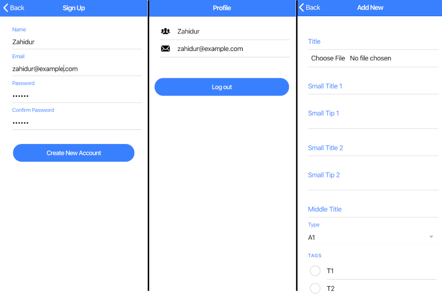

# Product Management App
This application is online-based full-stack system which allows users to manage and track products.

### Features
- Sign-in & Sign-out option
- Product dashboard based on user profile
- Add, Edit or delete product
- Add new user
- Assign user items
- Profile view

### Front-end tools

- Angular 8
- HTML
- CSS
- TypeScript

### Back-end tools

- PHP
- MySQL
- Firebase
- JSON
- RESTful API

### Screenshots

